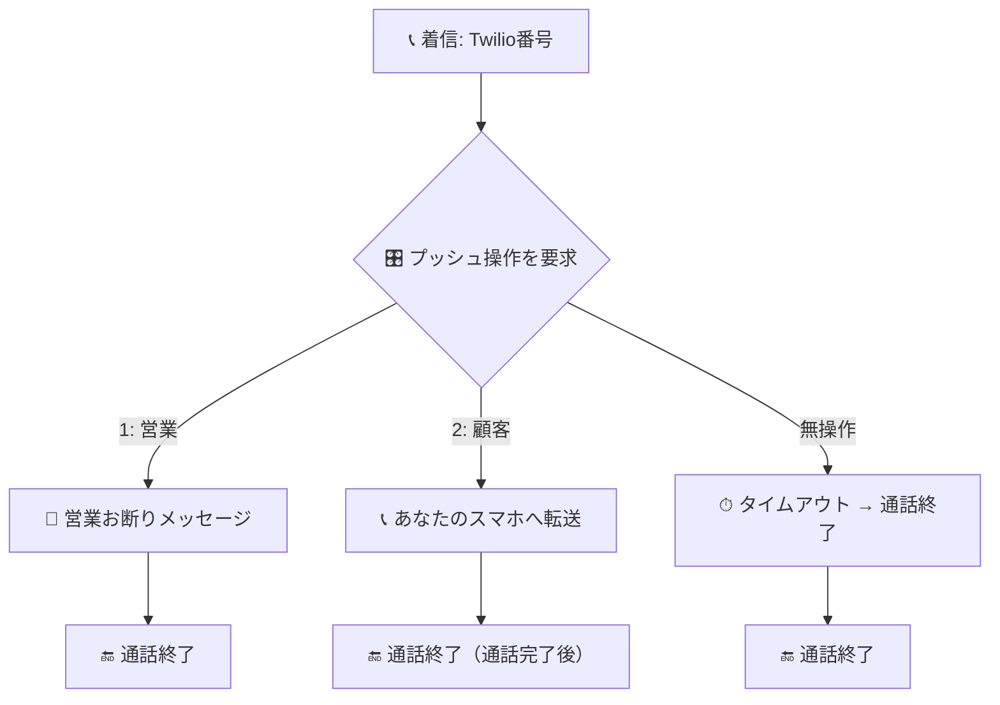

# Hamephone

破滅派の電話転送システム

## 🚀 機能

- **IVRメニュー**: 営業・返品・注文の振り分け
- **通話転送**: 2段階転送と直接転送
- **録音機能**: S3外部ストレージ対応
- **SMS通知**: 詳細な通話情報通知
- **Cloud Run対応**: 本番環境デプロイ



## 📁 プロジェクト構造

```
hamephone/
├── bin/                    # スクリプトファイル
│   ├── restart.sh         # ローカルサーバー再起動
│   ├── deploy.sh          # Cloud Runデプロイ
│   ├── setup-secrets.sh   # Secret Manager設定（対話式）
│   ├── auto-setup-secrets.sh # Secret Manager自動設定
│   └── setup-github-actions.sh # GitHub Actionsセットアップ
├── .github/workflows/     # GitHub Actions設定
│   ├── test.yml          # プルリクエスト時のテスト
│   └── deploy.yml        # mainブランチへのデプロイ
├── docs/                  # ドキュメント
│   └── github-actions-setup.md # GitHub Actions設定ガイド
├── server.js              # メインアプリケーション
├── server.test.js         # テストファイル
├── Dockerfile             # Docker設定
├── cloudbuild.yaml        # Cloud Build設定
└── package.json           # プロジェクト設定
```

## 📋 ローカル開発

### セットアップ
```bash
npm install
```

### 起動
```bash
# サーバー起動
npm start

# 再起動（推奨）
npm run restart

# 状態確認
npm run status
```

### テスト
```bash
npm test
```

## ☁️ Cloud Run デプロイ

### 前提条件
- Google Cloud SDK インストール済み
- `hametuha-cloud` プロジェクトアクセス権限

### 手動デプロイ
```bash
# Secret Manager設定（推奨）
npm run secrets:auto      # .envファイルから自動設定
npm run secrets:setup     # 対話式設定

# 完全デプロイ（推奨）
npm run deploy

# 個別デプロイ
npm run deploy:build  # イメージビルド
npm run deploy:run    # Cloud Runデプロイ
```

### GitHub Actions CI/CD（推奨）
```bash
# GitHub Actionsセットアップ
npm run github:setup

# 開発フロー
git checkout -b feature/new-feature
# 開発・テスト
git push origin feature/new-feature
# プルリクエスト作成 → テスト自動実行
# マージ → 自動デプロイ
```

### 環境変数設定
1. **.envファイル**を作成して以下の値を設定:
   ```bash
   TWILIO_ACCOUNT_SID=your_account_sid
   TWILIO_AUTH_TOKEN=your_auth_token
   TWILIO_PHONE_NUMBER=your_phone_number
   TWILIO_SMS_NUMBER=+17822088328
   FORWARD_TO=your_forward_number
   AWS_ACCESS_KEY_ID=your_aws_key
   AWS_SECRET_ACCESS_KEY=your_aws_secret
   ```

2. **自動設定実行**:
   ```bash
   npm run secrets:auto
   ```

3. **Twilioコンソール**でWebhook URLを更新

## 🏗️ アーキテクチャ

- **Node.js/Express**: Webサーバー
- **Twilio**: 電話・SMS機能
- **AWS S3**: 録音ファイル保存
- **Google Cloud Run**: 本番環境
- **Secret Manager**: 環境変数管理

## 📞 通話フロー

1. **着信** → IVRメニュー再生
2. **選択** → 営業/返品/注文振り分け
3. **転送** → 録音開始
4. **完了** → SMS通知 + S3保存

## 🔧 スクリプト一覧

| スクリプト | 説明 | コマンド |
|------------|------|----------|
| `bin/restart.sh` | ローカルサーバー再起動 | `npm run restart` |
| `bin/deploy.sh` | Cloud Runデプロイ | `npm run deploy` |
| `bin/setup-secrets.sh` | Secret Manager設定（対話式） | `npm run secrets:setup` |
| `bin/auto-setup-secrets.sh` | Secret Manager自動設定 | `npm run secrets:auto` |
| `bin/setup-github-actions.sh` | GitHub Actionsセットアップ | `npm run github:setup` |
| `bin/fix-cloudbuild-permissions.sh` | Cloud Build権限修正 | `npm run github:fix-permissions` |
